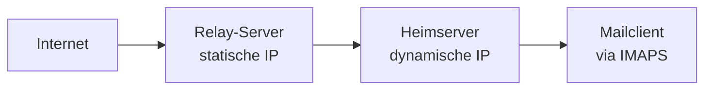

# Problemstellung: Self-Hosted Mail mit dynamischer IP

Viele technisch versierte Nutzer möchten ihre E-Mails selbst betreiben, stoßen dabei jedoch auf mehrere praktische Probleme. Der Betrieb eines Mailservers komplett aus dem Heimnetz ist zwar grundsätzlich möglich, führt aber häufig zu Schwierigkeiten bei der Zustellung und beim Empfang von E-Mails, da Mailserver mit dynamischen IP-Adressen von den großen Providern schnell ausgeschlossen werden.

---

## 🧭 Zweck

Dieses Kapitel beschreibt die Ausgangsprobleme beim Betrieb eines eigenen Mailservers mit dynamischer IP-Adresse und erklärt, warum eine spezielle Architektur nötig ist.

---

## ⚙️ Typische Probleme

### Dynamische IP-Adressen

Heim-Internetzugänge besitzen meist eine **dynamische IP-Adresse**. Das führt zu mehreren Hürden:

- Kein Reverse DNS möglich
- Schlechte Reputation bei großen Mailprovidern
- Häufige Blockierung durch Spamfilter

Viele Anbieter behandeln E-Mails aus dynamischen Netzen grundsätzlich mit Misstrauen.

### Reverse DNS

Für eine gute Zustellbarkeit erwarten Mailserver einen korrekt gesetzten **PTR-Record** und konsistentes Forward/Reverse-DNS. Diese Anforderungen können bei dynamischen Adressen in der Regel nicht erfüllt werden.

### Blocklisten

IP-Adressen aus Consumer-Netzen stehen oft pauschal auf **Blocklisten**. Dadurch können ausgehende Mails verzögert zugestellt werden, als Spam markiert werden oder komplett abgelehnt werden.

### Sicherheitsanforderungen moderner Mailserver

Heutige E-Mail-Infrastruktur erwartet zusätzliche Sicherheits- und Authentifizierungsmechanismen: SPF, DKIM, DMARC, TLS und eine saubere DNS-Konfiguration. Diese Anforderungen machen das Self-Hosting deutlich komplexer.

---

## 🧩 Ziel dieser Anleitung

Diese Anleitung zeigt, wie sich die genannten Probleme technisch umgehen lassen. Der Ansatz kombiniert:

- einen **SMTP-Relay-Server mit statischer IP**
- einen **Mailserver im Heimnetz**
- modernes DNS mit **DNSSEC**
- weitgehend **automatisierte Konfiguration**

Damit wird ermöglicht: zuverlässige Mailzustellung, vollständige Kontrolle über eigene E-Mails und der Betrieb eines stabilen Mailservers trotz dynamischer IP-Adresse.

---

## 🏗️ Architekturansatz

Die empfohlene Architektur trennt zwischen zwei Rollen:

1. **Internet-Facing Mail Relay** – übernimmt alle SMTP-Verbindungen zum Internet.
2. **Mailserver im Heimnetz** – verwaltet Mailboxen, IMAP-Zugriff und lokale Zustellung.

Das Relay dient als stabile Schnittstelle ins Internet, der Heimserver bleibt hinter der dynamischen IP erreichbar.

---

## 👤 Für wen diese Anleitung gedacht ist

Diese Anleitung richtet sich an Anwender mit:

- mindestens grundlegenden **Linux-Kenntnissen**
- Erfahrung im Bereich **SSH** und **Serveradministration**
- Grundverständnis von **DNS**

Besonders sinnvoll ist dieses Setup für Nutzer, die ihre E-Mails selbst hosten möchten, keine feste IP-Adresse besitzen und volle Kontrolle über ihre Infrastruktur wünschen.

---

## 🔄 Aufbau der Anleitung

1. [Problemstellung](../00_Einleitung/00_problem.md)
2. [Wann diese Lösung nicht geeignet ist](../00_Einleitung/01_wann_nicht_geeignet.md)
3. [Umfang dieser Anleitung](../00_Einleitung/02_scope.md)
4. [Begriffe und Komponenten](../00_Einleitung/03_glossar.md)
5. [Voraussetzungen](../01_Planung/04_voraussetzungen.md)
6. [DNS Setup](../01_Planung/05_dns_setup.md)
7. [Relay-Server einrichten](../02_Infrastruktur/06_relay_server.md)
8. [Heimserver einrichten](../02_Infrastruktur/07_home_server.md)
9. [DNS Mail-Records](../03_Konfiguration/08_dns_mail_records.md)
10. [DKIM einrichten](../03_Konfiguration/09_dkim.md)
11. [DMARC konfigurieren](../03_Konfiguration/10_dmarc.md)
12. [TLS für IMAP und SMTP](../03_Konfiguration/11_tls_imap_smtp.md)
13. [Spamfilter & Greylisting](../03_Konfiguration/12_spamfilter.md)
14. [Automatisierung](../04_Betrieb/13_automatisierung.md)
15. [Betrieb und Wartung](../04_Betrieb/14_betrieb_und_wartung.md)
16. [Troubleshooting](../04_Betrieb/15_troubleshooting.md)

---

## ✅ Ergebnis

Nach diesem Kapitel kennst du:

- die Hauptprobleme beim Mail-Self-Hosting
- die Ursachen von Zustellproblemen
- den Architekturgrundgedanken dieser Anleitung

---

## 🔁 Navigation

**→ Weiter:** [Wann diese Lösung nicht geeignet ist](../00_Einleitung/01_wann_nicht_geeignet.md)

