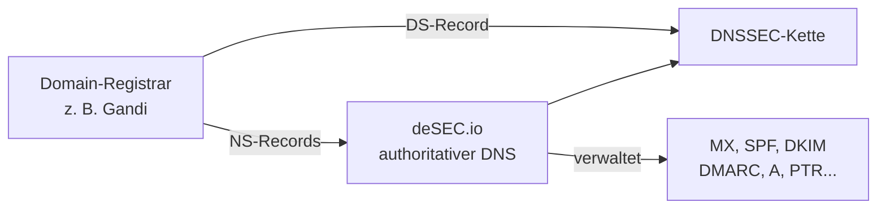

# DNS Setup

In diesem Kapitel wird deSEC als DNS-Provider eingerichtet und die Domain delegiert. Das ist die Grundlage für alle weiteren DNS-Einträge der Mail-Infrastruktur.

---

## Übersicht



---

## 1. Account bei deSEC anlegen

Unter [desec.io](https://desec.io) einen Account registrieren. deSEC ist ein kostenloser, DNSSEC-fähiger DNS-Provider.

---

## 2. Domain in deSEC anlegen

Nach der Registrierung die Domain im deSEC Control Panel hinzufügen:

```
example.com
```

deSEC weist der Domain autoritativen Nameserver zu:

```
ns1.desec.io
ns2.desec.io
```

---

## 3. Nameserver beim Registrar umstellen

Beim Domain-Registrar (hier: Gandi) die Nameserver auf die deSEC-Nameserver ändern:

```
ns1.desec.io
ns2.desec.io
```

Damit wird die DNS-Verwaltung vollständig an deSEC übergeben. Die Änderung kann einige Stunden dauern, bis sie im Internet propagiert ist.

---

## 4. DNSSEC aktivieren

deSEC unterstützt DNSSEC nativ. Nach dem Anlegen der Domain wird automatisch ein **DS Record** generiert.

Dieser DS Record muss beim Registrar hinterlegt werden, um die DNSSEC-Vertrauenskette zu schließen:

1. DS Record in deSEC abrufen (Control Panel → Domain → DNSSEC)
2. DS Record beim Registrar eintragen (bei Gandi: Domain → DNSSEC)

---

## 5. Überprüfung

DNS-Delegation prüfen:

```bash
dig NS example.com
# Erwartete Ausgabe: ns1.desec.io, ns2.desec.io
```

DNSSEC prüfen:

```bash
dig +dnssec example.com
# AD-Flag in der Antwort zeigt gültige DNSSEC-Signatur an
```

Oder über Online-Tools:

- [DNSViz](https://dnsviz.net) – grafische DNSSEC-Analyse
- [Verisign DNSSEC Analyzer](https://dnssec-analyzer.verisignlabs.com)

---

## ✅ Ergebnis

Nach diesem Kapitel:

- Die Domain wird über **deSEC.io** verwaltet
- **DNSSEC** ist aktiviert und die Vertrauenskette ist geschlossen
- DNS-Einträge können über das Control Panel oder die deSEC-API verwaltet werden

---

## 🔁 Navigation

**← Zurück:** [Voraussetzungen](../01_Planung/04_voraussetzungen.md)  
**→ Weiter:** [Registrar und DNS-Delegation](../01_Planung/05b_registrar_dns.md)

