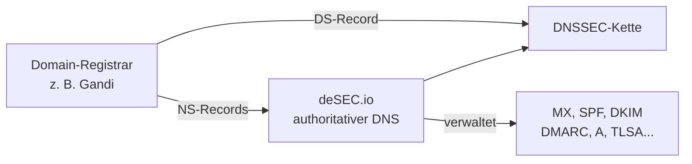

# DNS Setup

Dieses Kapitel erklärt warum für dieses Setup ein externer DNS-Provider nötig ist, welche Anforderungen er erfüllen muss und wie die DNS-Architektur aussieht. Die konkrete Einrichtung folgt im nächsten Kapitel.

---

## Warum externer DNS-Provider?

Der Standard-DNS vieler Registrare unterstützt keine dynamischen Updates per API. Für dieses Setup sind aber zwei Dinge zwingend erforderlich:

- **Dynamische A-Records** – die IP des Heimservers ändert sich und muss automatisch per API aktualisiert werden
- **DNSSEC** – für DANE/TLSA und allgemeine E-Mail-Sicherheit

**deSEC** erfüllt beide Anforderungen: DNSSEC nativ, vollständige REST-API für alle Record-Typen, kostenlos.

> Vor dem Kauf einer Domain prüfen ob der gewählte Registrar Custom Nameserver unterstützt. Die Funktion heisst je nach Anbieter „Custom NS", „Bring your own DNS" oder „externe Nameserver". Bei **Gandi** ist das unter *Domain → Nameserver* möglich.

---

## DNS-Architektur

Die Verwaltung aller DNS-Records liegt vollständig bei deSEC. Der Registrar kennt nur noch die Nameserver und den DS-Record für DNSSEC.

---

## Benötigte Records im Überblick

| Record | Name | Zweck |
|---|---|---|
| `A` | `{{DOMAIN}}` | Root-Domain → Relay |
| `A` | `mail` | Relay-Server |
| `MX` | `{{DOMAIN}}` | Mailempfang |
| `A` | `smtp` | Heimserver Submission (dynamisch) |
| `A` | `imap` | Heimserver IMAP (dynamisch) |
| `TXT` | `{{DOMAIN}}` | SPF |
| `TXT` | `default._domainkey` | DKIM |
| `TXT` | `_dmarc` | DMARC |
| `TLSA` | `_465._tcp.smtp` | DANE |

`smtp` und `imap` sind direkte A-Records – keine CNAMEs – weil sie per deSEC-API automatisch aktualisiert werden.

Die vollständige Konfiguration aller Records ist in [[03_Konfiguration/08_dns_mail_records|DNS Mail-Records]] beschrieben.

---

## 🔁 Navigation

**← Zurück:** [[01_Planung/04_voraussetzungen|Voraussetzungen]]  
**→ Weiter:** [[01_Planung/05b_registrar_dns|Registrar und DNS-Delegation]]
