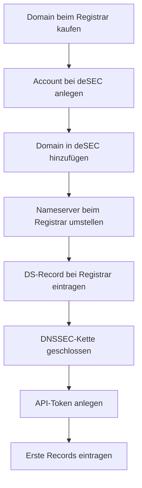

# Registrar und DNS-Delegation

Dieses Kapitel beschreibt die vollständige Einrichtung: von der Domain-Registrierung bis zum fertigen deSEC-Setup mit API-Token.

---

## Ablauf



---

## 1. Account bei deSEC anlegen

Unter [desec.io](https://desec.io) einen kostenlosen Account registrieren.

---

## 2. Domain in deSEC hinzufügen

Im deSEC Control Panel: *Domains → Add domain* → `{{DOMAIN}}` eintragen.

deSEC weist der Domain zwei autoritativen Nameserver zu:

```
ns1.desec.io
ns2.desec.io
```

---

## 3. Nameserver beim Registrar umstellen

Beim Registrar (hier: Gandi) unter *Domain → Nameserver → Extern* die deSEC-Nameserver eintragen:

```
ns1.desec.io
ns2.desec.io
```

Die Propagation dauert bis zu 24 Stunden. Prüfen:

```bash
dig NS {{DOMAIN}}
# Erwartete Ausgabe: ns1.desec.io, ns2.desec.io
```

---

## 4. DNSSEC aktivieren

deSEC aktiviert DNSSEC automatisch beim Anlegen der Domain. Den DS-Record abrufen:

Im deSEC Control Panel: *Domain → DNSSEC* → DS-Record kopieren.

Beim Registrar eintragen: bei Gandi unter *Domain → DNSSEC → DS-Record hinzufügen*.

Damit ist die DNSSEC-Vertrauenskette geschlossen – von der Root-Zone über den Registrar bis zu deSEC.

Prüfen:

```bash
dig +dnssec {{DOMAIN}}
# AD-Flag in der Antwort zeigt gültige DNSSEC-Signatur
```

Oder grafisch: [DNSViz](https://dnsviz.net) · [Verisign DNSSEC Analyzer](https://dnssec-analyzer.verisignlabs.com)

---

## 5. API-Token anlegen

Für automatische DNS-Updates (DynDNS-Skript, TLSA-Hook) wird ein API-Token benötigt.

Im deSEC Control Panel: *Token → Add token* → Token sicher speichern:

```bash
echo "DEIN_TOKEN" > /root/.dedyn-token
chmod 600 /root/.dedyn-token
```

API testen:

```bash
curl -s https://desec.io/api/v1/domains/ \
  -H "Authorization: Token $(cat /root/.dedyn-token)"
```

---

## 6. Erste Records anlegen

Direkt nach der Delegation die Basis-Records in deSEC eintragen:

| Record | Name | Wert | Zweck |
|---|---|---|---|
| `A` | `{{DOMAIN}}` | `{{RELAY_IP}}` | Root-Domain → Relay |
| `A` | `mail` | `{{RELAY_IP}}` | Relay-Server |
| `MX` | `{{DOMAIN}}` | `{{RELAY_HOSTNAME}}` | Mailempfang |
| `A` | `smtp` | `{{HOME_IP}}` | Heimserver Submission |
| `A` | `imap` | `{{HOME_IP}}` | Heimserver IMAP |

> `smtp` und `imap` werden später vom DynDNS-Skript automatisch aktualisiert. Für den Start reicht der manuelle Eintrag.

Alle weiteren Mail-Records (SPF, DKIM, DMARC, TLSA) werden in [[03_Konfiguration/08_dns_mail_records|DNS Mail-Records]] eingerichtet.

---

## ✅ Ergebnis

Nach diesem Kapitel:

- Die Domain wird vollständig über deSEC verwaltet
- DNSSEC ist aktiv, die Vertrauenskette ist geschlossen
- Ein API-Token für automatische Updates liegt unter `/root/.dedyn-token` bereit
- Die Basis-Records sind eingetragen

---

## 🔁 Navigation

**← Zurück:** [[01_Planung/05_dns_setup|DNS Setup]]  
**→ Weiter:** [[02_Infrastruktur/06_relay_server|Relay-Server einrichten]]
