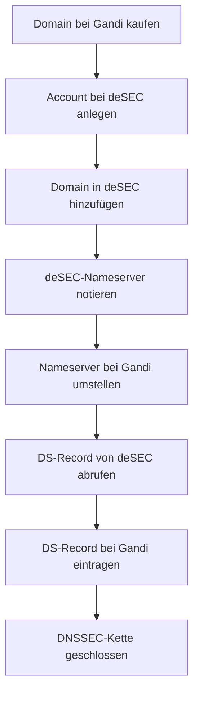

# Registrar und DNS-Delegation

Für dieses Setup wird die DNS-Verwaltung vom Registrar (Gandi) an einen externen DNS-Provider (deSEC) delegiert. Dieses Kapitel beschreibt warum das nötig ist und wie es eingerichtet wird.

---

## Warum externer DNS-Provider?

Der Standard-DNS vieler Registrare unterstützt keine dynamischen Updates per API. Für dieses Setup sind aber zwei Dinge zwingend erforderlich:

- **Dynamische A-Records** – die IP des Heimservers ändert sich und muss automatisch per API aktualisiert werden
- **DNSSEC** – für DANE/TLSA und allgemeine E-Mail-Sicherheit

deSEC bietet beides: DNSSEC nativ, eine REST-API für alle Record-Typen und ist kostenlos.

---

## Voraussetzung: Custom Nameserver beim Registrar

Nicht alle Registrare erlauben das Setzen eigener Nameserver. Die Funktion heisst je nach Anbieter „Custom NS", „Bring your own DNS" oder „externe Nameserver".

Bei **Gandi** ist das möglich und im Control Panel unter *Domain → Nameserver* erreichbar.

> Vor dem Kauf einer Domain prüfen ob der gewählte Registrar Custom Nameserver unterstützt.

---

## Ablauf der DNS-Delegation



---

## 1. Account bei deSEC anlegen

Unter [desec.io](https://desec.io) einen kostenlosen Account registrieren.

---

## 2. Domain in deSEC hinzufügen

Im deSEC Control Panel: *Domains → Add domain* → `{{DOMAIN}}` eintragen.

deSEC weist der Domain zwei autoritativen Nameserver zu:

```
ns1.desec.io
ns2.desec.io
```

---

## 3. Nameserver bei Gandi umstellen

Im Gandi Control Panel: *Domain → Nameserver → Extern* – die deSEC-Nameserver eintragen:

```
ns1.desec.io
ns2.desec.io
```

Die Propagation dauert bis zu 24 Stunden. Prüfen:

```bash
dig NS {{DOMAIN}}
# Erwartete Ausgabe: ns1.desec.io, ns2.desec.io
```

---

## 4. DNSSEC aktivieren

deSEC aktiviert DNSSEC automatisch. Den DS-Record abrufen:

Im deSEC Control Panel: *Domain → DNSSEC* → DS-Record kopieren.

Diesen DS-Record bei Gandi eintragen: *Domain → DNSSEC → DS-Record hinzufügen*.

Damit ist die DNSSEC-Vertrauenskette geschlossen – von der Root-Zone über Gandi bis zu deSEC.

DNSSEC prüfen:

```bash
dig +dnssec {{DOMAIN}}
# AD-Flag in der Antwort zeigt gültige DNSSEC-Signatur
```

Oder grafisch: [DNSViz](https://dnsviz.net)

---

## 5. API-Token für deSEC anlegen

Für automatische DNS-Updates (DynDNS-Skript, TLSA-Hook) wird ein API-Token benötigt.

Im deSEC Control Panel: *Token → Add token* → Token sicher speichern:

```bash
echo "DEIN_TOKEN" > /root/.dedyn-token
chmod 600 /root/.dedyn-token
```

API testen:

```bash
curl -s https://desec.io/api/v1/domains/ \
  -H "Authorization: Token $(cat /root/.dedyn-token)"
```

---

## 6. Erste DNS-Records anlegen

Nach der Delegation können alle Mail-relevanten Records in deSEC eingetragen werden. Die Records werden in [DNS Mail-Records](../03_Konfiguration/08_dns_mail_records.md) beschrieben.

Für den Start werden mindestens benötigt:

| Record | Wert | Zweck |
|---|---|---|
| `A` @ | `{{RELAY_IP}}` | Root-Domain → Relay |
| `MX` @ | `{{RELAY_HOSTNAME}}` | Mailempfang |
| `A` mail | `{{RELAY_IP}}` | Relay-Server |
| `A` smtp | `{{HOME_IP}}` | Heimserver Submission |
| `A` imap | `{{HOME_IP}}` | Heimserver IMAP |

> `smtp` und `imap` sind direkte A-Records – keine CNAMEs – weil sie per deSEC-API automatisch aktualisiert werden.

---

## ✅ Ergebnis

Nach diesem Kapitel:

- Die Domain wird vollständig über deSEC verwaltet
- DNSSEC ist aktiv, die Vertrauenskette ist geschlossen
- Ein API-Token für automatische Updates liegt bereit
- DNS-Records können per API oder Control Panel verwaltet werden

---

## 🔁 Navigation

**← Zurück:** [DNS Setup](../01_Planung/05_dns_setup.md)  
**→ Weiter:** [Relay-Server einrichten](../02_Infrastruktur/06_relay_server.md)

