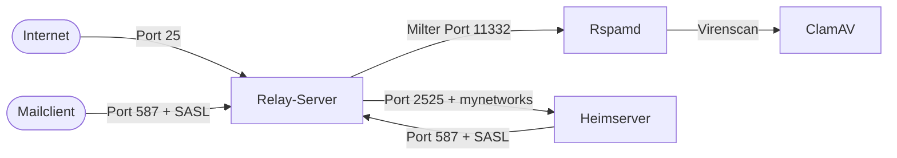

# Relay-Server einrichten

Der Relay-Server (`{{RELAY_HOSTNAME}}`) ist die einzige Komponente dieser Architektur mit einer statischen öffentlichen IP-Adresse (`{{RELAY_IP}}`). Er übernimmt die gesamte SMTP-Kommunikation mit dem Internet – der Heimserver bleibt nach außen unsichtbar.

---

## Architektur



---

## Rolle des Relay-Servers

- Empfang eingehender E-Mails aus dem Internet (Port 25)
- Spamfilterung und Virenscan via Rspamd + ClamAV
- Weiterleitung an den Heimserver (Port 2525, IP-basiert via `mynetworks`)
- Entgegennahme ausgehender Mails vom Heimserver (Port 587, SASL: `{{RELAY_SASL_USER}}`)
- Versand ausgehender Mails direkt ins Internet
- Systemmails (Bounces) an `{{DOMAIN}}`-Adressen über `transport_maps` an den Heimserver

---

## 1. System vorbereiten

```bash
apt update && apt upgrade -y
apt install vim curl git iptables-persistent
```

---

## 2. Hostname konfigurieren

```bash
hostnamectl set-hostname {{RELAY_HOSTNAME}}
```

`/etc/hosts` anpassen:

```
127.0.1.1   {{RELAY_HOSTNAME}} mail
```

Prüfen:

```bash
hostname -f
# Erwartete Ausgabe: {{RELAY_HOSTNAME}}
```

---

## 3. Reverse DNS konfigurieren

Der PTR-Record wird beim Hoster (Netcup) konfiguriert:

```
{{RELAY_IP}}  →  {{RELAY_HOSTNAME}}
```

Forward und Reverse DNS müssen konsistent sein:

```
{{RELAY_HOSTNAME}}  →  {{RELAY_IP}}        (A-Record bei deSEC)
{{RELAY_IP}}        →  {{RELAY_HOSTNAME}}  (PTR-Record bei Netcup)
```

Prüfen:

```bash
dig A {{RELAY_HOSTNAME}}
dig -x {{RELAY_IP}}
```

---

## 4. Firewall konfigurieren

Der Relay-Server nutzt `iptables` mit einer **restriktiven Policy** (INPUT DROP). Die Regeln werden dynamisch gesetzt, weil SSH, Submission (587) und DNS-Zugriff nur vom Heimserver erlaubt sind – dessen IP sich dynamisch ändert.

| Port | Protokoll | Zugang | Zweck |
|---|---|---|---|
| 22 | TCP | Heimserver-IP | SSH |
| 25 | TCP | alle | SMTP eingehend |
| 80 / 443 | TCP | alle | HTTP/HTTPS (Let's Encrypt, MTA-STS) |
| 587 | TCP | Heimserver-IP | Submission vom Heimserver |
| 2525 | TCP | Heimserver-IP | Eingehende Mails vom Heimserver |
| 53 | TCP/UDP | Heimserver-IP | DNS (Unbound) |

Die Firewall wird über `/usr/local/bin/update_relay_ip.sh` gesetzt. Das Skript ermittelt die aktuelle IP des Heimservers per DNS, setzt alle iptables- und ip6tables-Regeln neu und speichert sie persistent. Es aktualisiert ausserdem die Unbound-`access-control`-Konfiguration.

```bash
# Firewall neu setzen (z. B. nach IP-Wechsel des Heimservers):
/usr/local/bin/update_relay_ip.sh
```

Das Skript sollte per Cronjob regelmäßig ausgeführt werden, damit die Regeln bei IP-Wechsel des Heimservers aktuell bleiben:

```bash
# /etc/cron.d/update-relay-ip
*/15 * * * * root /usr/local/bin/update_relay_ip.sh >> /var/log/update_relay_ip.log 2>&1
```

Regeln prüfen:

```bash
iptables -L INPUT -n --line-numbers
ip6tables -L INPUT -n --line-numbers
```

Gespeicherte Regeln liegen in `/etc/iptables/rules.v4` und `/etc/iptables/rules.v6`.

Das vollständige Skript ist in der [Config Library](../05_Referenz/config_library.md) dokumentiert.

---

## 5. Postfix installieren und konfigurieren

```bash
apt install postfix
```

Während der Installation: **„Internet Site"** wählen, `{{RELAY_HOSTNAME}}` als System-Mailname eintragen.

Die vollständige Konfiguration liegt in der [Config Library](../05_Referenz/config_library.md). Wesentliche Direktiven in `/etc/postfix/main.cf`:

```ini
myhostname = {{RELAY_HOSTNAME}}
myorigin = /etc/mailname
mydestination = localhost
relay_domains = {{DOMAIN}}

# Weiterleitung zum Heimserver
transport_maps = hash:/etc/postfix/transport

# Relay-IP ist vertrauenswürdig (mynetworks statt SASL)
mynetworks = 127.0.0.0/8 [::1]/128

# Rspamd Milter
smtpd_milters = inet:localhost:11332
non_smtpd_milters = inet:localhost:11332
milter_default_action = accept
milter_protocol = 6

# RBL-Prüfungen
smtpd_client_restrictions =
    permit_mynetworks,
    permit_sasl_authenticated,
    reject_rbl_client dnsbl.sorbs.net,
    reject_rbl_client bl.spamcop.net,
    reject_rbl_client b.barracudacentral.org,
    reject_rbl_client psbl.surriel.com,
    permit

# kein relayhost – ausgehende Mails direkt ins Internet
relayhost =
```

> `mydestination` enthält nur `localhost` – der Relay stellt keine Mails lokal zu.

### Weiterleitung zum Heimserver

`/etc/postfix/transport`:

```
{{DOMAIN}}    smtp:[{{HOME_SMTP}}]:2525
```

Die eckigen Klammern unterdrücken MX-Lookup. Port 2525 auf dem Heimserver akzeptiert Verbindungen von der Relay-IP ohne SASL (via `mynetworks`).

```bash
postmap /etc/postfix/transport
postfix reload
```

---

## 6. Rspamd installieren und konfigurieren

```bash
apt install rspamd
```

### systemd-Override

Rspamd muss als `_rspamd` laufen. Override anlegen:

```bash
mkdir -p /etc/systemd/system/rspamd.service.d
cat > /etc/systemd/system/rspamd.service.d/override.conf << 'EOF'
[Service]
User=_rspamd
Group=_rspamd
EOF
```

> **Wichtig:** Die Datei muss mit einem Newline enden – sonst parst systemd `Group=_rspamd` nicht korrekt und Rspamd startet nicht.

### Runtime-Verzeichnis

Rspamd benötigt `/run/rspamd/` – dieses Verzeichnis überlebt Reboots nicht ohne tmpfiles.d:

```bash
mkdir -p /run/rspamd
chown _rspamd:_rspamd /run/rspamd
echo "d /run/rspamd 0755 _rspamd _rspamd -" > /etc/tmpfiles.d/rspamd.conf
```

### Milter-Port konfigurieren

Rspamd läuft auf Port **11332**. Port 12301 ist auf dem Relay von OpenDKIM belegt und darf nicht verwendet werden.

`/etc/rspamd/local.d/worker-proxy.inc`:

```
milter = true;
bind_socket = "127.0.0.1:11332";
milter_mail_macros = "i, mail_addr, rcpt_addr, from_addr, rcpt_user, rcpt_domain";
```

Weitere Konfigurationsdateien in der [Config Library](../05_Referenz/config_library.md).

### Starten

```bash
systemctl daemon-reload
systemctl enable rspamd
systemctl start rspamd
sleep 3
ss -tlnp | grep -E "11332|11334"
```

---

## 7. ClamAV installieren

```bash
apt install clamav clamav-daemon
systemctl enable clamav-daemon clamav-freshclam
systemctl start clamav-daemon clamav-freshclam
```

---

## 8. Überprüfung

```bash
systemctl status postfix rspamd clamav-daemon
ss -tlnp | grep -E "25|587|11332|11334"
rspamc -h 127.0.0.1:11334 stat
```

Testmail senden:

```bash
echo "Subject: Test" | sendmail -f test@{{DOMAIN}} {{ADMIN_MAIL}}
tail -20 /var/log/mail.log
```

---

## ✅ Ergebnis

Nach diesem Kapitel:

- Postfix empfängt Mails auf Port 25 und leitet sie an den Heimserver weiter (Port 2525)
- Rspamd filtert eingehende Mails via Milter (Port 11332)
- ClamAV scannt Anhänge
- Ausgehende Mails vom Heimserver (Port 587, SASL) werden direkt ins Internet weitergeleitet
- Bounces an `{{DOMAIN}}`-Adressen gehen über `transport_maps` an den Heimserver

---

## 🔁 Navigation

**← Zurück:** [DNS Setup](../01_Planung/05_dns_setup.md)  
**→ Weiter:** [Heimserver einrichten](../02_Infrastruktur/07_home_server.md)

