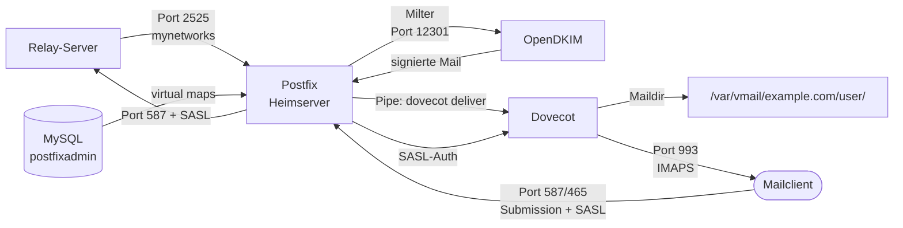

# Heimserver einrichten

Der Heimserver ist der eigentliche Mailserver des Systems. Er empfängt Mails vom Relay-Server, stellt sie lokal zu und macht sie per IMAP für Mailclients erreichbar. Ausgehende Mails werden signiert und über den Relay-Server ins Internet weitergeleitet.

Mailboxen und Domains werden über **PostfixAdmin** mit einem MySQL-Backend verwaltet.

---

## Architektur



---

## Rolle des Heimservers

- Eingehende Mails: vom Relay-Server (Port 2525, nur `mynetworks`)
- Ausgehende Mails: über Relay-Server (Port 587, SASL-Auth mit `{{RELAY_SASL_USER}}`)
- Mailclient-Einlieferung: Port 587 (STARTTLS) und Port 465 (SSL/TLS), SASL via Dovecot
- Mailzustellung: Postfix → Dovecot via Pipe (`dovecot deliver`)
- Mailspeicherung: Maildir unter `/var/vmail`
- Mailboxverwaltung: PostfixAdmin mit MySQL

---

## Firewall-Architektur

Der Heimserver steht hinter einer **Fritz!Box**, die als primäre Firewall fungiert. Nur explizit freigegebene Ports erreichen den Heimserver:

| Port | Protokoll | Zweck |
|---|---|---|
| 22 | TCP | SSH |
| 80 / 443 | TCP | HTTP/HTTPS (Apache, Certbot) |
| 143 | TCP | IMAP (unverschlüsselt, intern) |
| 465 | TCP | SMTPS – Mailclient-Einlieferung |
| 587 | TCP | Submission – Mailclient-Einlieferung |
| 993 | TCP | IMAPS |
| 2525 | TCP | SMTP vom Relay-Server |

> Port 25 ist bewusst **nicht** freigegeben – eingehende Mails kommen ausschließlich vom Relay über Port 2525.

Auf dem Heimserver selbst läuft `iptables` mit offener INPUT-Policy (`ACCEPT`). Der Schutz erfolgt über:

- **Fritz!Box** – Port-Whitelist
- **Blacklist** – IP-Sets via `ipset` (`match-set blacklist src`)
- **Fail2Ban** – automatisches Sperren bei Brute-Force (SSH, Apache)
- **GeoIP-Blocking** – `xt_geoip`-Chain blockt Länder ohne legitimen Mailverkehr
- **Tor-Blocking** – `/etc/iptables/drop_tor.sh` (siehe unten)

### Blacklist-System

Das Blacklist-System kombiniert externe IP-Listen, Fail2Ban-Bans und GeoIP-Blocking in einem `ipset`:

| Komponente | Skript | Ausführung |
|---|---|---|
| Einmaliges Setup | `init_blacklist.sh` | Nur beim ersten Einrichten |
| Tägliche Aktualisierung | `update-blacklist.sh` | Cronjob täglich 02:00 |
| Fail2Ban → Blacklist | `cpfail2ban2bl.sh` | Wird von update-Skripten aufgerufen |
| GeoIP-Daten aktualisieren | `update_xt_geoip.sh` | Bei Bedarf (monatlich) |

Alle Skripte sind in der [Config Library](../05_Referenz/config_library.md) dokumentiert.

Regeln persistent speichern (nach Änderungen):

```bash
netfilter-persistent save
# Regeln liegen in: /etc/iptables/rules.v4
```

### Tor-Exit-Node-Blocking

Das Skript `/etc/iptables/drop_tor.sh` lädt die aktuelle Liste der Tor-Exit-Nodes von `dan.me.uk` und blockt sie per iptables-Chain `TOR`.

```bash
# Manuell ausführen:
bash /etc/iptables/drop_tor.sh
```

> **Wichtig:** Die TOR-Chain wird **nicht** in `rules.v4` gespeichert – sie existiert nur im laufenden iptables und muss nach jedem Reboot erneut ausgeführt werden. Für automatische Ausführung beim Systemstart Cronjob oder systemd-Unit einrichten:

```bash
# Cronjob (täglich um 3 Uhr, z. B. in /etc/cron.d/drop-tor):
0 3 * * * root /etc/iptables/drop_tor.sh >> /var/log/drop_tor.log 2>&1
```

Das vollständige Skript ist in der [Config Library](../05_Referenz/config_library.md) dokumentiert.

---

## 1. System vorbereiten

```bash
apt update && apt upgrade -y
apt install postfix postfix-mysql dovecot-imapd dovecot-core mysql-server
```

Während der Postfix-Installation: **„Internet Site"** wählen, `{{DOMAIN}}` als Systemname eintragen.

---

## 2. Hostname konfigurieren

```bash
hostnamectl set-hostname {{HOME_SMTP}}
```

`/etc/hosts` anpassen:

```
127.0.1.1   {{HOME_SMTP}} {{HOME_HOSTNAME}}
```

`/etc/mailname`:

```
{{DOMAIN}}
```

Prüfen:

```bash
hostname -f
# Erwartete Ausgabe: {{HOME_SMTP}}
```

---

## 3. vmail-Benutzer anlegen

Mailboxen werden unter `/var/vmail` als Benutzer `vmail` (UID/GID 5000) gespeichert:

```bash
groupadd -g 5000 vmail
useradd -g vmail -u 5000 vmail -d /var/vmail -m
```

---

## 4. MySQL und PostfixAdmin einrichten

PostfixAdmin verwaltet Domains, Mailboxen und Aliases in einer MySQL-Datenbank.

### Datenbank anlegen

```sql
CREATE DATABASE postfixadmin CHARACTER SET utf8mb4;
CREATE USER 'postfixadmin'@'localhost' IDENTIFIED BY '{{SECRET_DB_PASSWORD}}';
GRANT ALL PRIVILEGES ON postfixadmin.* TO 'postfixadmin'@'localhost';
FLUSH PRIVILEGES;
```

### PostfixAdmin installieren

PostfixAdmin ist eine PHP-Webanwendung. Installation und Webserver-Konfiguration sind nicht Teil dieser Anleitung – die PostfixAdmin-Dokumentation beschreibt den Prozess vollständig. Nach der Installation initialisiert PostfixAdmin das Datenbankschema automatisch.

Die fertigen MySQL-Map-Dateien für Postfix liegen in der [Config Library](../05_Referenz/config_library.md).

---

## 5. Postfix konfigurieren

### `/etc/postfix/main.cf`

Die vollständige Konfiguration liegt in der [Config Library](../05_Referenz/config_library.md). Wesentliche Direktiven:

```ini
myhostname = {{HOME_SMTP}}
myorigin = /etc/mailname
mydestination = $myhostname, localhost.$mydomain, localhost
local_recipient_maps =

# Virtuelle Mailboxen via PostfixAdmin/MySQL
mailbox_transport = dovecot
virtual_alias_maps = mysql:/etc/postfix/mysql_virtual_alias_maps.cf
virtual_mailbox_domains = mysql:/etc/postfix/mysql_virtual_domains_maps.cf
virtual_mailbox_maps = mysql:/etc/postfix/mysql_virtual_mailbox_maps.cf
virtual_mailbox_base = /var/vmail
virtual_uid_maps = static:5000
virtual_gid_maps = static:5000

inet_interfaces = all
inet_protocols = ipv4

# Ausgehende Mails über Relay (Port 587, SASL)
relayhost = [{{RELAY_HOSTNAME}}]:587
smtp_use_tls = yes
smtp_tls_security_level = encrypt
smtp_tls_CApath = /etc/letsencrypt/live/{{HOME_SMTP}}
smtp_sasl_auth_enable = yes
smtp_sasl_password_maps = hash:/etc/postfix/sasl_passwd
smtp_sasl_security_options = noanonymous

# Erlaubte Absender (Relay-IP fest, kein Hostname)
mynetworks = 127.0.0.0/8 192.168.1.0/24 {{RELAY_IP}}

# SASL für Mailclients via Dovecot
smtpd_sasl_type = dovecot
smtpd_sasl_path = private/auth_dovecot
smtpd_sasl_auth_enable = yes

# TLS
smtpd_tls_cert_file = /etc/letsencrypt/live/{{HOME_SMTP}}/fullchain.pem
smtpd_tls_key_file = /etc/letsencrypt/live/{{HOME_SMTP}}/privkey.pem
smtpd_tls_security_level = may
smtpd_tls_mandatory_protocols = TLSv1.2 TLSv1.3
smtpd_tls_dh1024_param_file = /etc/ssl/certs/dh4096.pem

# OpenDKIM Milter
milter_default_action = accept
milter_protocol = 6
smtpd_milters = inet:localhost:12301
non_smtpd_milters = $smtpd_milters
```

### SASL-Passwort für Relay hinterlegen

```bash
echo "[{{RELAY_HOSTNAME}}]:587    {{RELAY_SASL_USER}}:{{SECRET_RELAY_SASL_PASSWORD}}" \
  > /etc/postfix/sasl_passwd
postmap hash:/etc/postfix/sasl_passwd
chmod 600 /etc/postfix/sasl_passwd /etc/postfix/sasl_passwd.db
```

> `{{RELAY_SASL_USER}}` ist ein dedizierter Benutzer auf dem Relay-Server, der dort für die SASL-Authentifizierung eingerichtet ist. Siehe [Relay-Server einrichten](../02_Infrastruktur/06_relay_server.md).

### `/etc/postfix/master.cf`

Relevante Einträge – vollständige Datei in der [Config Library](../05_Referenz/config_library.md):

```
# Port 25 – nur mynetworks (Relay-Server)
smtp       inet  n  -  y  -  -  smtpd
  -o smtpd_tls_security_level=may
  -o smtpd_recipient_restrictions=permit_mynetworks,reject

# Port 465 – SMTPS (Wrapper-Mode)
smtps      inet  n  -  y  -  -  smtpd
  -o smtpd_tls_wrappermode=yes
  -o smtpd_sasl_auth_enable=yes
  -o smtpd_recipient_restrictions=permit_sasl_authenticated,reject

# Port 587 – Submission (STARTTLS)
submission inet n  -  y  -  -  smtpd
  -o smtpd_tls_security_level=encrypt
  -o smtpd_sasl_auth_enable=yes
  -o smtpd_recipient_restrictions=permit_sasl_authenticated,reject

# Port 2525 – Einlieferung vom Relay (nur mynetworks)
2525      inet  n  -  y  -  -  smtpd
  -o syslog_name=postfix/2525
  -o smtpd_tls_security_level=encrypt
  -o smtpd_sasl_auth_enable=yes
  -o smtpd_sasl_type=dovecot
  -o smtpd_sasl_path=private/auth
  -o smtpd_relay_restrictions=permit_sasl_authenticated,reject
  -o milter_macro_daemon_name=ORIGINATING

# Dovecot-Zustellung via Pipe
dovecot    unix  -  n  n  -  -  pipe
  flags=DRhu user=vmail:vmail argv=/usr/lib/dovecot/deliver -d ${recipient}
```

### MySQL-Map-Dateien anlegen

Alle fünf MySQL-Map-Dateien aus der [Config Library](../05_Referenz/config_library.md) nach `/etc/postfix/` kopieren und `{{SECRET_DB_PASSWORD}}` durch das echte Passwort ersetzen.

Berechtigungen setzen:

```bash
chmod 640 /etc/postfix/mysql_*.cf
chown root:postfix /etc/postfix/mysql_*.cf
```

---

## 6. Dovecot konfigurieren

Dovecot empfängt Mails über den Pipe-Transport von Postfix (`dovecot deliver`) und stellt IMAP, POP3 und ManageSieve bereit. Benutzer und Mailbox-Pfade werden aus der PostfixAdmin-MySQL-Datenbank abgefragt.

Die vollständigen Konfigurationsdateien liegen in der [Config Library](../05_Referenz/config_library.md). Wesentliche Punkte:

**Protokolle** (`dovecot.conf`):

```
protocols = imap pop3 sieve
```

**Auth-Backend** (`dovecot.conf`):

```
passdb {
  driver = sql
  args = /etc/dovecot/dovecot-mysql.conf
}
userdb {
  driver = sql
  args = /etc/dovecot/dovecot-mysql.conf
}
```

**MySQL-Verbindung** (`/etc/dovecot/dovecot-mysql.conf`):

```ini
driver = mysql
connect = host=localhost dbname=postfixadmin user=postfixadmin password={{SECRET_DB_PASSWORD}}
default_pass_scheme = PLAIN-MD5
password_query = SELECT password FROM mailbox WHERE username = '%u'
user_query = SELECT CONCAT('maildir:/var/vmail/',maildir) AS mail, 5000 AS uid, 5000 AS gid FROM mailbox WHERE username = '%u'
```

> Die `user_query` liefert den Maildir-Pfad direkt aus der Datenbank. Eine separate `mail_location`-Direktive ist nicht nötig.

**SASL-Socket für Postfix** (`dovecot.conf`):

```
service auth {
  unix_listener /var/spool/postfix/private/auth_dovecot {
    group = postfix
    mode = 0660
    user = postfix
  }
  user = root
}
```

**TLS** (`dovecot.conf`):

```
ssl = required
ssl_cert = </etc/letsencrypt/live/{{HOME_IMAP}}/fullchain.pem
ssl_key = </etc/letsencrypt/live/{{HOME_IMAP}}/privkey.pem
ssl_dh = </etc/dovecot/dh.pem
```

**DH-Parameter erzeugen:**

```bash
openssl dhparam -out /etc/dovecot/dh.pem 4096
```

> TLS-Zertifikat und Certbot-Hook für `{{HOME_IMAP}}` folgen in [TLS für IMAP und SMTP](../03_Konfiguration/11_tls_imap_smtp.md).

---

## 7. DH-Parameter erzeugen

Postfix und Dovecot nutzen separate DH-Dateien:

```bash
# Für Postfix
openssl dhparam -out /etc/ssl/certs/dh4096.pem 4096

# Für Dovecot
openssl dhparam -out /etc/dovecot/dh.pem 4096
```

> Beide Befehle können parallel auf zwei Terminals ausgeführt werden. Jeder dauert mehrere Minuten.

---

## 8. Zertifikate im Postfix-Chroot

Postfix läuft im Chroot unter `/var/spool/postfix/`. TLS-Zertifikate und `/etc/hosts` müssen dort gespiegelt werden – das übernimmt der Certbot Deploy-Hook automatisch (siehe [Automatisierung](../04_Betrieb/13_automatisierung.md)).

Initial manuell anlegen:

```bash
cp /etc/letsencrypt/live/{{HOME_SMTP}}/fullchain.pem /var/spool/postfix/etc/letsencrypt/live/{{HOME_SMTP}}/
cp /etc/letsencrypt/live/{{HOME_SMTP}}/chain.pem /var/spool/postfix/etc/letsencrypt/live/{{HOME_SMTP}}/
cp /etc/letsencrypt/live/{{HOME_SMTP}}/cert.pem /var/spool/postfix/etc/letsencrypt/live/{{HOME_SMTP}}/
cp /etc/letsencrypt/live/{{HOME_SMTP}}/privkey.pem /var/spool/postfix/etc/letsencrypt/live/{{HOME_SMTP}}/
cp /etc/hosts /var/spool/postfix/etc/hosts
```

> Beim `postfix stop && postfix start` erscheinen Warnungen wenn Chroot-Dateien veraltet sind.

---

## 9. Dienste starten

```bash
systemctl restart postfix dovecot opendkim
systemctl status postfix dovecot opendkim
```

---

## 10. Überprüfung

> **Hinweis:** Postfix auf dem Heimserver loggt via **journald**, nicht nach `/var/log/mail.log`. Logs abfragen mit:
> ```bash
> journalctl -u postfix --since "10 minutes ago"
> ```

Port 2525 aktiv:

```bash
telnet {{HOME_SMTP}} 25
# Erwartete Ausgabe: 220 {{HOME_SMTP}} ESMTP Postfix
```

SASL-Socket vorhanden:

```bash
ls -la /var/spool/postfix/private/auth_dovecot
```

MySQL-Maps testen:

```bash
postmap -q {{DOMAIN}} mysql:/etc/postfix/mysql_virtual_domains_maps.cf
# Erwartete Ausgabe: {{DOMAIN}}
```

Relay-Auth testen:

```bash
postmap -q "[{{RELAY_HOSTNAME}}]:587" hash:/etc/postfix/sasl_passwd
```

OpenDKIM-Milter aktiv:

```bash
ss -tlnp | grep 12301
```

---

## Mailclient-Einstellungen

| Einstellung | Wert |
|---|---|
| SMTP-Server | `{{HOME_SMTP}}` |
| Port (STARTTLS) | `587` |
| Port (SSL/TLS) | `465` |
| Authentifizierung | Benutzername + Passwort |
| IMAP-Server | `{{HOME_IMAP}}` |
| Port | `993` |
| Verschlüsselung | SSL/TLS |

---

## ✅ Ergebnis

Nach diesem Kapitel:

- Postfix empfängt Mails vom Relay und weist alle anderen Verbindungen auf Port 25 ab
- Ausgehende Mails werden über den Relay-Server weitergeleitet (Port 587, SASL)
- Mailclients können sich per SASL auf Port 587 und 465 authentifizieren
- OpenDKIM signiert ausgehende Mails via Milter
- Dovecot empfängt Mails via Pipe-Transport und stellt sie im Maildir-Format zu
- Mailboxen und Domains werden über PostfixAdmin/MySQL verwaltet

---

## 🔁 Navigation

**← Zurück:** [Relay-Server einrichten](../02_Infrastruktur/06_relay_server.md)  
**→ Weiter:** [DNS Mail-Records](../03_Konfiguration/08_dns_mail_records.md)

