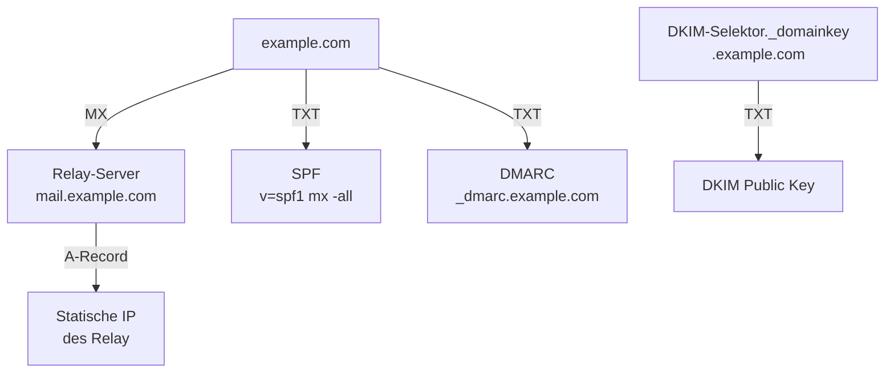

# DNS Mail-Records

In diesem Kapitel werden alle DNS-Einträge eingerichtet, die für den Mailbetrieb erforderlich sind. Sie definieren, welcher Server Mails empfängt, welche Server senden dürfen und wie Empfänger die Authentizität prüfen können.

Alle Einträge werden bei **deSEC.io** verwaltet.

---

## Übersicht



| Record | Name | Zweck |
|---|---|---|
| A | `mail.example.com` | IP-Adresse des Relay-Servers |
| MX | `example.com` | Mailserver der Domain |
| TXT | `example.com` | SPF – erlaubte Absender |
| TXT | `{{DKIM_SELECTOR}}._domainkey.{{DOMAIN}}` | DKIM – öffentlicher Schlüssel |
| TXT | `_dmarc.{{DOMAIN}}` | DMARC – Richtlinie und Reporting |

---

## 1. A-Record für den Relay-Server

```
mail.example.com    A    1.2.3.4
```

Dieser Record ist die Grundlage für MX und Reverse DNS.

---

## 2. MX-Record

```
example.com    MX    10 mail.example.com
```

Der MX-Record verweist auf den Relay-Server. Alle eingehenden Mails für `example.com` werden dort zugestellt.

---

## 3. SPF-Record

SPF (Sender Policy Framework) legt fest, welche Server E-Mails für die Domain versenden dürfen. Empfangende Mailserver prüfen, ob die sendende IP im SPF-Record der Absender-Domain aufgeführt ist.

**Record für `{{DOMAIN}}`:**

```
{{DOMAIN}}    TXT    "v=spf1 mx -all"
```

### Syntax-Erklärung

| Mechanismus | Bedeutung |
|---|---|
| `v=spf1` | SPF-Version, muss immer am Anfang stehen |
| `mx` | Der im MX-Record eingetragene Server ist erlaubt – hier `{{RELAY_HOSTNAME}}` ({{RELAY_IP}}) |
| `-all` | Alle anderen Server werden abgelehnt (Hardfail) |

Alternativer Qualifier für `all`:

| Qualifier | Bedeutung | Empfehlung |
|---|---|---|
| `-all` | Hardfail – Mail wird abgelehnt | Empfohlen wenn Setup stabil ist |
| `~all` | Softfail – Mail wird akzeptiert aber markiert | Sinnvoll während der Einrichtung |
| `?all` | Neutral – keine Aussage | Nicht empfohlen |

> In diesem Setup versendet **nur der Relay-Server** Mails ins Internet. `mx` reicht daher aus – der Heimserver taucht nicht direkt im SPF auf, weil er nur über den Relay weiterleitet.

### Validierung

```bash
dig TXT {{DOMAIN}} | grep spf
# Erwartete Ausgabe: "v=spf1 mx -all"
```

Online-Test: [MXToolbox SPF Check](https://mxtoolbox.com/spf.aspx)

### Häufige Fehler

- **Mehrere SPF-Records:** Es darf nur **einen** TXT-Record mit `v=spf1` pro Domain geben. Mehrere Records führen zu SPF `permerror`.
- **Heimserver-IP direkt eingetragen:** Nicht nötig – der Heimserver sendet nie direkt ins Internet.
- **`include` für externe Dienste vergessen:** Wenn z. B. ein Newsletter-Dienst im Namen der Domain versendet, muss dessen IP oder `include`-Mechanismus ergänzt werden.

---

## 4. DKIM-Record

Der öffentliche DKIM-Schlüssel wird im DNS veröffentlicht. Der Selektor `{{DKIM_SELECTOR}}` entspricht der Konfiguration von OpenDKIM auf dem Heimserver.

```
{{DKIM_SELECTOR}}._domainkey.{{DOMAIN}}    TXT    "v=DKIM1; k=rsa; p=PUBLICKEY"
```

Den tatsächlichen Wert für `p=` liefert OpenDKIM bei der Schlüsselerzeugung. Die vollständige Einrichtung folgt in [DKIM einrichten](../03_Konfiguration/09_dkim.md).

---

## 5. DMARC-Record

DMARC verbindet SPF und DKIM und definiert, wie empfangende Server mit Fehlern umgehen sollen.

```
_dmarc.{{DOMAIN}}    TXT    "v=DMARC1; p=quarantine; rua=mailto:{{DMARC_MAIL}}; adkim=s; aspf=s"
```

Parameter:

| Parameter | Wert | Bedeutung |
|---|---|---|
| `p` | `quarantine` | Mails ohne gültiges SPF/DKIM als Spam behandeln |
| `rua` | `mailto:...` | Adresse für aggregierte Berichte |
| `adkim` | `s` | DKIM-Alignment strict |
| `aspf` | `s` | SPF-Alignment strict |

> Für neue Setups zunächst `p=none` verwenden und nach Beobachtung auf `quarantine` oder `reject` erhöhen. Details in [DMARC konfigurieren](../03_Konfiguration/10_dmarc.md).

---

## 6. Überprüfung

```bash
# A-Record
dig A mail.example.com

# MX
dig MX example.com

# SPF
dig TXT example.com

# DKIM
dig TXT {{DKIM_SELECTOR}}._domainkey.{{DOMAIN}}

# DMARC
dig TXT _dmarc.{{DOMAIN}}
```

Online-Tools für eine vollständige Prüfung:

- [MXToolbox](https://mxtoolbox.com) – MX, SPF, DMARC
- [mail-tester.com](https://www.mail-tester.com) – Gesamtbewertung einer Testmail

---

## ✅ Ergebnis

Nach diesem Kapitel:

- Der Relay-Server ist per A- und MX-Record erreichbar
- SPF ist konfiguriert
- Der DKIM-DNS-Record ist vorbereitet (Schlüssel folgt in Kapitel 09)
- DMARC ist aktiv

---

## 🔁 Navigation

**← Zurück:** [Heimserver einrichten](../02_Infrastruktur/07_home_server.md)  
**→ Weiter:** [DKIM einrichten](../03_Konfiguration/09_dkim.md)

