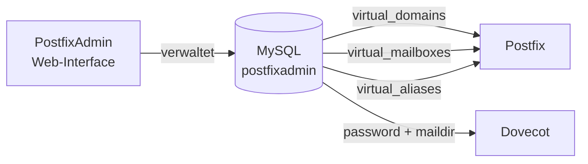

# PostfixAdmin und MySQL

Mailboxen, Domains und Aliases werden über **PostfixAdmin** mit einem MySQL-Backend verwaltet. Postfix und Dovecot fragen die Datenbank direkt über MySQL-Map-Dateien ab.

---

## Architektur



---

## Datenbank anlegen

```sql
CREATE DATABASE postfixadmin CHARACTER SET utf8mb4;
CREATE USER 'postfixadmin'@'localhost' IDENTIFIED BY '{{SECRET_DB_PASSWORD}}';
GRANT ALL PRIVILEGES ON postfixadmin.* TO 'postfixadmin'@'localhost';
FLUSH PRIVILEGES;
```

---

## PostfixAdmin installieren

PostfixAdmin ist eine PHP-Webanwendung. Nach der Installation unter dem konfigurierten Web-URL aufrufen – PostfixAdmin initialisiert das Datenbankschema automatisch beim ersten Aufruf.

Die PostfixAdmin-Dokumentation beschreibt die Webserver-Konfiguration vollständig.

---

## Postfix MySQL-Maps

Postfix fragt die Datenbank über fünf Map-Dateien ab. Alle Dateien liegen in der [Config Library](../05_Referenz/config_library.md).

Berechtigungen setzen:

```bash
chmod 640 /etc/postfix/mysql_*.cf
chown root:postfix /etc/postfix/mysql_*.cf
```

Maps testen:

```bash
# Domain vorhanden?
postmap -q {{DOMAIN}} mysql:/etc/postfix/mysql_virtual_domains_maps.cf

# Mailbox vorhanden?
postmap -q {{ADMIN_MAIL}} mysql:/etc/postfix/mysql_virtual_mailbox_maps.cf

# Alias vorhanden?
postmap -q postmaster@{{DOMAIN}} mysql:/etc/postfix/mysql_virtual_alias_maps.cf
```

---

## Dovecot MySQL-Verbindung

Dovecot nutzt dieselbe Datenbank für Authentifizierung und Mailbox-Pfade.

`/etc/dovecot/dovecot-mysql.conf`:

```ini
driver = mysql
connect = host=localhost dbname=postfixadmin user=postfixadmin password={{SECRET_DB_PASSWORD}}
default_pass_scheme = PLAIN-MD5
password_query = SELECT password FROM mailbox WHERE username = '%u'
user_query = SELECT CONCAT('maildir:/var/vmail/',maildir) AS mail, \
             5000 AS uid, 5000 AS gid FROM mailbox WHERE username = '%u'
```

Die `user_query` liefert den Maildir-Pfad direkt aus der Datenbank – eine separate `mail_location`-Direktive ist nicht nötig.

---

## Mailboxen verwalten

Über das PostfixAdmin Web-Interface:

- Domains anlegen und verwalten
- Mailboxen anlegen, Passwörter setzen
- Aliases und Weiterleitungen konfigurieren
- Quotas setzen

### Dedizierte Systembenutzer

Neben normalen Mailboxen gibt es zwei dedizierte PostfixAdmin-User für interne Zwecke:

| Benutzer | Zweck |
|---|---|
| `submission-relay@{{DOMAIN}}` | Reserviert – aktuell ungenutzt |

> Systembenutzer haben keine normalen IMAP-Mailboxen und sollten in PostfixAdmin entsprechend markiert werden.

---

## Backup

Die MySQL-Datenbank enthält alle Mailboxkonfigurationen und muss regelmäßig gesichert werden:

```bash
mysqldump -u postfixadmin -p postfixadmin > /backup/postfixadmin-$(date +%Y-%m-%d).sql
```

---

## ✅ Ergebnis

Nach diesem Kapitel:

- PostfixAdmin verwaltet Domains und Mailboxen in MySQL
- Postfix fragt Domains, Mailboxen und Aliases per MySQL-Maps ab
- Dovecot authentifiziert Benutzer und ermittelt Maildir-Pfade aus der Datenbank

---

## 🔁 Navigation

**← Zurück:** [DNS Mail-Records](../03_Konfiguration/08_dns_mail_records.md)  
**→ Weiter:** [DKIM einrichten](../03_Konfiguration/09_dkim.md)

