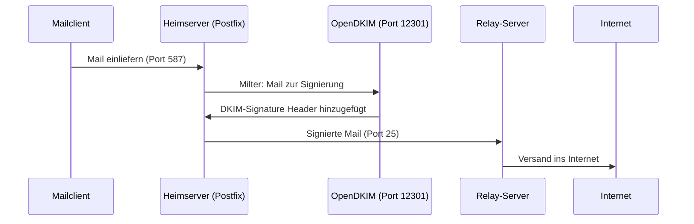

# DKIM einrichten

DKIM (DomainKeys Identified Mail) signiert ausgehende E-Mails kryptographisch. Empfangende Mailserver können damit prüfen, ob eine Nachricht tatsächlich von der angegebenen Domain stammt und ob sie unterwegs verändert wurde.

In diesem Setup signiert **OpenDKIM auf dem Heimserver**. Der Relay-Server verifiziert eingehende Signaturen über Rspamd, erzeugt aber keine eigenen.

---

## Ablauf



---

## 1. OpenDKIM installieren

```bash
apt install opendkim opendkim-tools
```

---

## 2. Verzeichnisstruktur vorbereiten

```bash
mkdir -p /etc/opendkim/keys/{{DOMAIN}}
chown -R opendkim:opendkim /etc/opendkim
chmod 700 /etc/opendkim/keys/{{DOMAIN}}
```

---

## 3. DKIM-Schlüssel erzeugen

```bash
cd /etc/opendkim/keys/{{DOMAIN}}
opendkim-genkey -s {{DKIM_SELECTOR}} -d {{DOMAIN}}
chown opendkim:opendkim {{DKIM_SELECTOR}}.private
chmod 600 {{DKIM_SELECTOR}}.private
```

Es entstehen zwei Dateien:

| Datei | Inhalt |
|---|---|
| `{{DKIM_SELECTOR}}.private` | Privater Schlüssel – verbleibt auf dem Server |
| `{{DKIM_SELECTOR}}.txt` | Öffentlicher Schlüssel – wird im DNS eingetragen |

---

## 4. Key Table konfigurieren

`/etc/opendkim/key.table`:

```
{{DKIM_SELECTOR}}._domainkey.{{DOMAIN}}    {{DOMAIN}}:{{DKIM_SELECTOR}}:/etc/opendkim/keys/{{DOMAIN}}/{{DKIM_SELECTOR}}.private
```

---

## 5. Signing Table konfigurieren

`/etc/opendkim/signing.table`:

```
*@{{DOMAIN}}    {{DKIM_SELECTOR}}._domainkey.{{DOMAIN}}
```

---

## 6. Trusted Hosts konfigurieren

`/etc/opendkim/trusted.hosts`:

```
127.0.0.1
localhost
{{DOMAIN}}
```

---

## 7. OpenDKIM konfigurieren

`/etc/opendkim.conf`:

```
AutoRestart             Yes
Canonicalization        relaxed/simple
Mode                    sv
SubDomains              no

KeyTable                /etc/opendkim/key.table
SigningTable            refile:/etc/opendkim/signing.table
TrustedHosts            /etc/opendkim/trusted.hosts

Socket                  inet:12301@localhost
```

> **Port 12301:** Auf dem Relay-Server nutzt Rspamd denselben Port lokal. Kein Konflikt – beide Dienste sind nur an `localhost` des jeweiligen Servers gebunden.

---

## 8. Postfix mit OpenDKIM verbinden

`/etc/postfix/main.cf`:

```ini
milter_default_action = accept
milter_protocol = 6
smtpd_milters = inet:localhost:12301
non_smtpd_milters = $smtpd_milters
```

```bash
systemctl restart opendkim postfix
```

---

## 9. DKIM-Record im DNS eintragen

Öffentlichen Schlüssel auslesen:

```bash
cat /etc/opendkim/keys/{{DOMAIN}}/{{DKIM_SELECTOR}}.txt
```

Beispielausgabe:

```
{{DKIM_SELECTOR}}._domainkey    IN    TXT    ( "v=DKIM1; k=rsa; "
    "p=MIGfMA0GCSqGSIb3DQEBAQUAA4GNADCBiQ..." )
```

Den vollständigen Wert (alle Teilstrings zusammengesetzt) als TXT-Record bei deSEC eintragen:

```
{{DKIM_SELECTOR}}._domainkey.{{DOMAIN}}    TXT    "v=DKIM1; k=rsa; p=MIGfMA0..."
```

---

## 10. Überprüfung

DNS-Record prüfen:

```bash
dig TXT {{DKIM_SELECTOR}}._domainkey.{{DOMAIN}}
```

OpenDKIM-Schlüssel testen:

```bash
opendkim-testkey -d {{DOMAIN}} -s {{DKIM_SELECTOR}} -vvv
# Erwartete Ausgabe enthält: key OK
```

Funktionstest: Testmail senden, Header beim Empfänger prüfen:

```
DKIM-Signature: v=1; a=rsa-sha256; c=relaxed/simple; d={{DOMAIN}}; s={{DKIM_SELECTOR}}; ...
```

Und in den Authentication-Results des Empfängers:

```
dkim=pass header.i=@{{DOMAIN}} header.s={{DKIM_SELECTOR}}
```

---

## Hinweis: Rspamd DKIM-Signing

Auf dem Relay-Server ist Rspamd ebenfalls mit einer `dkim_signing.conf` konfiguriert. Im aktuellen Mailflow signiert Rspamd jedoch nicht – OpenDKIM auf dem Heimserver ist die aktive Signierungsquelle. Die Rspamd-Konfiguration kann als Fallback belassen oder mit `sign_local = false` explizit deaktiviert werden.

---

## ✅ Ergebnis

Nach diesem Kapitel:

- OpenDKIM signiert alle ausgehenden Mails der Domain
- Der öffentliche Schlüssel ist im DNS veröffentlicht
- Postfix übergibt Mails an OpenDKIM via Milter (Port 12301)
- Empfangende Server können die Signatur verifizieren

---

## 🔁 Navigation

**← Zurück:** [DNS Mail-Records](../03_Konfiguration/08_dns_mail_records.md)  
**→ Weiter:** [DMARC konfigurieren](../03_Konfiguration/10_dmarc.md)

