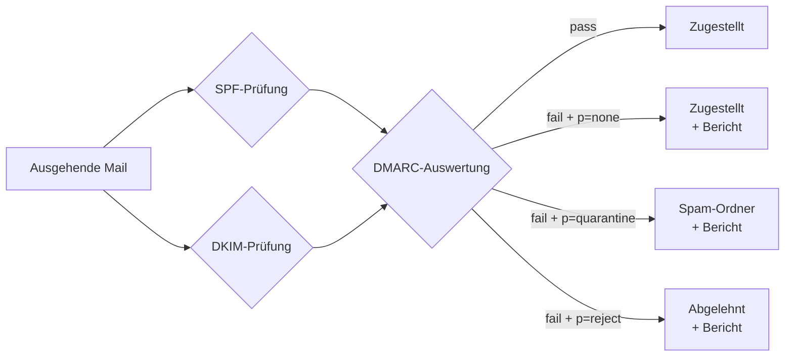

# DMARC konfigurieren

DMARC (Domain-based Message Authentication, Reporting and Conformance) baut auf SPF und DKIM auf. Es definiert, wie empfangende Mailserver mit Nachrichten umgehen sollen, die SPF oder DKIM nicht bestehen – und liefert Berichte über den Authentifizierungsstatus ausgehender Mails.

---

## Zusammenspiel von SPF, DKIM und DMARC



DMARC greift nur, wenn **mindestens einer** der beiden Mechanismen (SPF oder DKIM) aligned passt. „Aligned" bedeutet, dass die geprüfte Domain mit der `From:`-Adresse übereinstimmt.

---

## 1. DMARC-Record erstellen

Der Record wird als TXT-Eintrag unter `_dmarc.{{DOMAIN}}` bei deSEC angelegt.

Vollständiger Record für dieses Setup:

```
_dmarc.{{DOMAIN}}    TXT    "v=DMARC1; p=quarantine; rua=mailto:{{DMARC_MAIL}}; adkim=s; aspf=s"
```

---

## 2. Parameter im Überblick

| Parameter | Wert | Bedeutung |
|---|---|---|
| `v` | `DMARC1` | Version (Pflichtfeld) |
| `p` | `quarantine` | Fehlschlagende Mails als Spam behandeln |
| `rua` | `mailto:...` | Adresse für aggregierte XML-Berichte |
| `adkim` | `s` | DKIM strict alignment – Domain muss exakt übereinstimmen |
| `aspf` | `s` | SPF strict alignment – Domain muss exakt übereinstimmen |

---

## 3. Policy-Eskalation

Für neue Setups empfiehlt sich ein schrittweiser Aufbau:

**Phase 1 – Monitoring** (kein Einfluss auf Zustellung):
```
p=none; rua=mailto:{{DMARC_MAIL}}
```

**Phase 2 – Quarantine** (nach Beobachtung, wenn Reports sauber sind):
```
p=quarantine
```

**Phase 3 – Reject** (vollständige Durchsetzung):
```
p=reject
```

> In diesem Setup ist bereits `p=quarantine` aktiv (sichtbar im Mail-Header: `dmarc=pass (p=QUARANTINE)`). Eine Eskalation auf `reject` ist möglich, sobald die DMARC-Reports über mehrere Wochen keine Fehlschläge aus legitimen Quellen zeigen.

---

## 4. DMARC-Reports lesen

Empfangende Mailserver senden täglich XML-Berichte an die `rua`-Adresse. Die Berichte enthalten:

- Sendende IP-Adressen
- Anzahl der Mails pro IP
- SPF- und DKIM-Ergebnis je Mail
- Angewandte DMARC-Policy

Die XML-Dateien sind für Menschen schwer lesbar. Hilfreiche Auswertungstools:

- [Postmark DMARC Digests](https://dmarc.postmarkapp.com) – kostenlos, übersichtlich
- [dmarcian](https://dmarcian.com) – detaillierte Analyse

---

## 5. Überprüfung

```bash
dig TXT _dmarc.{{DOMAIN}}
```

Online-Prüfung:

- [MXToolbox DMARC Check](https://mxtoolbox.com/dmarc.aspx)

---

## ✅ Ergebnis

Nach diesem Kapitel:

- DMARC ist im DNS konfiguriert
- Aggregierte Berichte werden gesammelt
- SPF und DKIM sind über DMARC verknüpft

Die Mail-Authentifizierung (SPF + DKIM + DMARC) ist damit vollständig eingerichtet.

---

## 🔁 Navigation

**← Zurück:** [DKIM einrichten](../03_Konfiguration/09_dkim.md)  
**→ Weiter:** [TLS für IMAP und SMTP](../03_Konfiguration/11_tls_imap_smtp.md)

