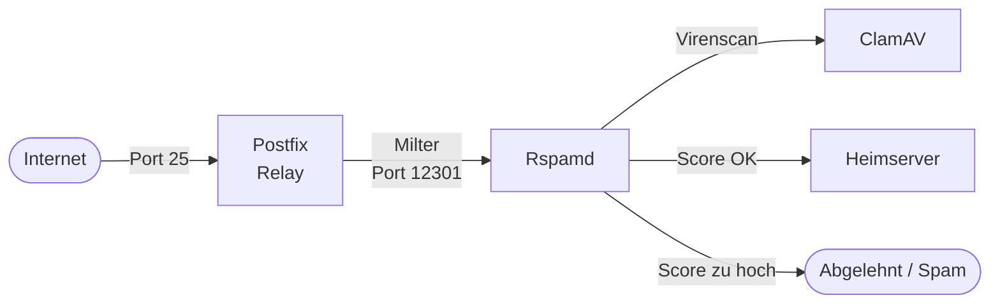

# Spamfilter & Virenschutz

Der Relay-Server übernimmt die gesamte Filterung eingehender Mails. In diesem Setup laufen auf dem Relay:

- **Rspamd** – Spamfilter, Greylisting, DKIM-Signierung und -Verifikation
- **ClamAV** – Virenscan, eingebunden über Rspamd

Postgrey wird nicht verwendet – Greylisting ist nativ in Rspamd integriert.

---

## Architektur



---

## Rspamd

### Installation

```bash
apt install rspamd
```

### Postfix-Integration

Rspamd wird als Milter in Postfix eingebunden.

`/etc/postfix/main.cf`:

```ini
smtpd_milters = inet:localhost:11332
non_smtpd_milters = inet:localhost:11332
milter_default_action = accept
milter_protocol = 6
```

> **Wichtig:** Port 11332 ist der korrekte Rspamd Proxy-Worker Port auf dem Relay. Port 12301 ist auf dem Relay von OpenDKIM belegt und darf nicht verwendet werden.

### Konfigurationsstruktur

Rspamd wird über `/etc/rspamd/local.d/` konfiguriert. Dateien dort überschreiben die Standardkonfiguration ohne sie zu verändern – Änderungen in `/etc/rspamd/rspamd.conf` direkt sind nicht empfohlen.

Aktive lokale Konfigurationsdateien:

| Datei | Funktion |
|---|---|
| `dkim_signing.conf` | DKIM-Signierung ausgehender Mails |
| `antivirus.conf` | ClamAV-Integration |
| `spf.conf` | SPF-Prüfung |
| `worker-proxy.inc` | Milter-Proxy Konfiguration |

### DKIM-Signierung in Rspamd

Rspamd signiert ausgehende Mails direkt – das ist die primäre DKIM-Methode in diesem Setup.

`/etc/rspamd/local.d/dkim_signing.conf`:

```
domain {
  {{DOMAIN}} {
    selector = "default";
    path = "/etc/rspamd/dkim/default.{{DOMAIN}}.key";
  }
}
sign_local = true;
sign_authenticated = true;
use_domain = "header";
```

> **Hinweis:** OpenDKIM läuft zusätzlich auf dem Heimserver und erzeugt eine zweite DKIM-Signatur. Mehrere Signaturen sind technisch erlaubt, aber redundant. Wer vereinfachen möchte: `sign_local = false` in dieser Datei deaktiviert die Rspamd-Signierung, OpenDKIM übernimmt dann allein. Oder umgekehrt: OpenDKIM auf dem Heimserver deaktivieren und Rspamd als einzige Signierungsquelle nutzen. Beide Varianten funktionieren.

Den DKIM-Schlüssel für Rspamd erzeugen:

```bash
mkdir -p /etc/rspamd/dkim
rspamadm dkim_keygen -s default -d {{DOMAIN}} -k /etc/rspamd/dkim/default.{{DOMAIN}}.key
```

Die Ausgabe enthält den öffentlichen Schlüssel für den DNS-Record (siehe [DKIM einrichten](../03_Konfiguration/09_dkim.md)).

### Greylisting

Rspamd enthält natives Greylisting. Mails von unbekannten Absendern werden beim ersten Zustellversuch temporär abgelehnt (451) – legitime Mailserver versuchen es erneut, Spam-Bots meist nicht.

Aktivierungsschwelle: Score ≥ 4 (Standardwert).

Whitelist für bekannte Domains unter:
```
/etc/rspamd/local.d/greylist-whitelist-domains.inc
/etc/rspamd/local.d/maps.d/greylist-whitelist-domains.inc
```

### Rspamd Web-Interface

Rspamd stellt ein Web-Interface bereit:

```bash
# Passwort setzen
rspamadm pw
# Ausgabe in worker-controller.inc eintragen
```

`/etc/rspamd/local.d/worker-controller.inc`:

```
bind_socket = "localhost:11334";
password = "$2$HASH";
```

Zugriff via SSH-Tunnel:

```bash
ssh -L 11334:localhost:11334 user@{{RELAY_HOSTNAME}}
# Dann im Browser: http://localhost:11334
```

---

## ClamAV

### Installation

```bash
apt install clamav clamav-daemon
```

### Rspamd-Integration

`/etc/rspamd/local.d/antivirus.conf`:

```
clamav {
  action = "reject";
  symbol = "CLAM_VIRUS";
  type = "clamav";
  log_clean = false;
  servers = "/run/clamav/clamd.ctl";
  whitelist = "/etc/rspamd/antivirus.wl";
}
```

### Signaturen aktuell halten

ClamAV aktualisiert seine Virensignaturen automatisch über `freshclam`:

```bash
systemctl status clamav-freshclam
```

ClamAV benötigt etwa **1 GB RAM** im laufenden Betrieb – beim Relay-Server bei der Dimensionierung berücksichtigen.

---

## Überprüfung

Rspamd-Status:

```bash
systemctl status rspamd
```

ClamAV-Status:

```bash
systemctl status clamav-daemon
```

Rspamd-Statistiken:

```bash
rspamc stat
```

Testmail durch Rspamd jagen:

```bash
rspamc < /path/to/testmail.eml
```

GTUBE-Spamtest (Standard-Teststring, wird von jedem Spamfilter erkannt):

```bash
echo "XJS*C4JDBQADN1.NSBN3*2IDNEN*GTUBE-STANDARD-ANTI-UBE-TEST-EMAIL*C.34X" | \
  mail -s "spam test" testaddress@example.com
```

---

## ✅ Ergebnis

Nach diesem Kapitel:

- Rspamd filtert eingehende Mails auf dem Relay
- ClamAV scannt Anhänge auf Viren
- Greylisting ist aktiv für unbekannte Absender
- DKIM-Signierung ausgehender Mails läuft über Rspamd

---

## 🔁 Navigation

**← Zurück:** [TLS für IMAP und SMTP](../03_Konfiguration/11_tls_imap_smtp.md)  
**→ Weiter:** [Automatisierung](../04_Betrieb/13_automatisierung.md)

